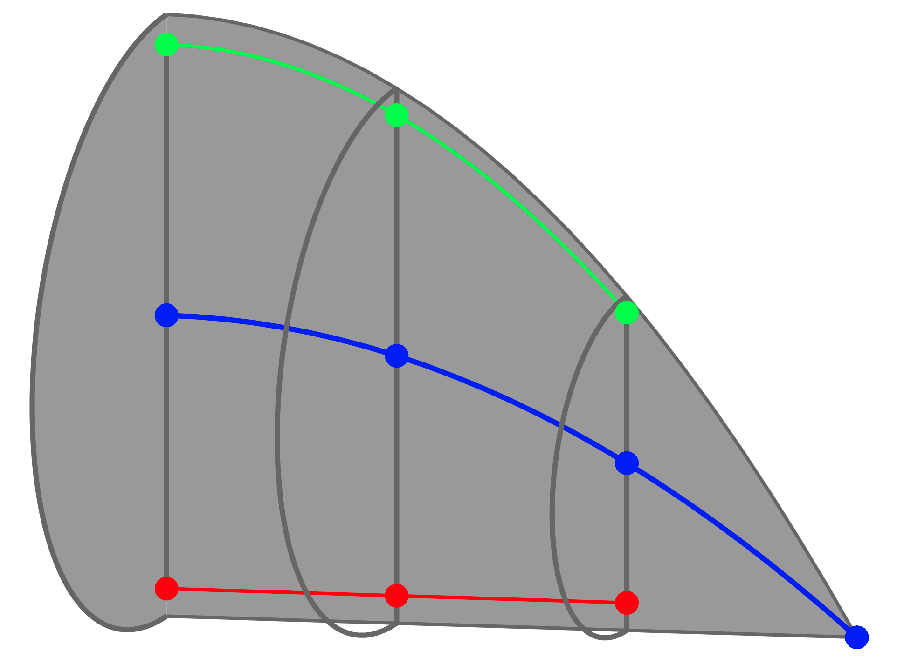

[](https://opensource.org/licenses/MIT)
[](https://zenodo.org/badge/latestdoi/419436511)
[](https://www.python.org/)
[](https://github.com/psf/black)
[](https://mybinder.org/v2/gh/JulianKarlBauer/planar_fiber_orientation_tensors_2021/HEAD)

<p align="center">
  <a href="https://github.com/JulianKarlBauer/planar_fiber_orientation_tensors_2021">
  
  </a>
</p>

# PlanarFibers

This repository contains a Python package called `planarfibers`  
which contains selected contributions of the paper

```bibtex
@article{insertdoihere,
	author = {Julian Karl Bauer and Thomas Böhlke},
	title ={Fiber Orientation Distributions Based on Planar Fiber Orientation Tensors of Fourth Order},
	journal = {Mathematics and Mechanics of Solids},
}
```

Please see [license][url_license],
[acknowledgment](#acknowledgment)
and cite the [paper given above][url_mms_article] and the latest [Zenodo-DOI][url_latest_doi].

## Installation

- [Clone][url_how_to_clone] this repository to your machine
- Open a terminal and navigate to your local clone
- Install the package from the local clone into the current [env][url_env_python]i[ronment][url_env_conda] in editable/development mode with pip:
	```shell
	pip install -e .
	```

Note: [Develop vs. install](https://stackoverflow.com/a/19048754/8935243)
Note: As the required package `vofotensors` is not on [PyPI][url_pypi] and has to be downloaded and installed directly from Github, installation with `python setup.py develop` does [not work][url_install_from_github].

## Examples

Both example notebooks and example scripts are given [here](examples/).

## Acknowledgment

The research documented in this repository has been funded by the German Research Foundation (DFG) within the
International Research Training Group [“Integrated engineering of continuous-discontinuous long fiber reinforced polymer structures“ (GRK 2078)][grk_website].
The support by the [German Research Foundation (DFG)][dfg_website] is gratefully acknowledged.

[grk_website]: https://www.grk2078.kit.edu/
[dfg_website]: https://www.dfg.de/

[url_license]: LICENSE
[url_latest_doi]: ??
[url_mms_article]: ??
[url_how_to_clone]: https://docs.github.com/en/repositories/creating-and-managing-repositories/cloning-a-repository

[url_env_python]: https://docs.python.org/3/tutorial/venv.html
[url_env_conda]: https://docs.conda.io/projects/conda/en/latest/user-guide/tasks/manage-environments.html

[url_pypi]: https://pypi.org/
[url_install_from_github]: https://github.com/facebookresearch/Detectron/issues/963#issuecomment-552169878
